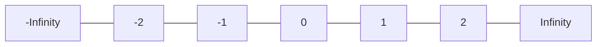

## Day 01

### ✅ Problems Solved

1. [Search an element in an array](./search-element.js)
2. [Count Negative number](./count-negative-number.js)
3. [Find Largest number in an array](./find-largest-number.js)

### Notes

**Why -1 is not a good starting value for finding the largest number**

If you initialize the largest value as -1, it can give incorrect results when all numbers in the array are less than -1.



```js
[-5, -10, -3];
```

Here, the correct largest number is -3, but since -1 is already greater than all elements, your algorithm will incorrectly return -1.

👉 That’s why -1 is not a safe starting value.

✅ **Correct Approach**

Initialize the largest value with negative infinity (-Infinity):

- -Infinity is smaller than every possible number
- So any number in the array will always be greater than it
